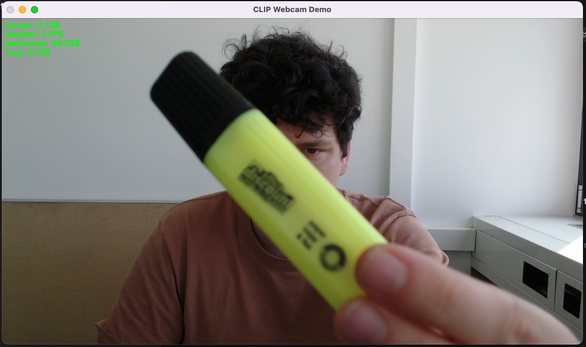

# CLIP Webcam Demo 

A simple real-time webcam demo using OpenAI's [CLIP](https://openai.com/research/clip) model for **zero-shot classification**.

🖼️ Captures live frames from your webcam  
🧾 You enter a list of class names (e.g. "cat", "mug", "face")  
🤖 It shows the predicted class probabilities on top of each frame  




---

## 📦 Requirements

- Python 3.8+
- `torch`
- `transformers`
- `Pillow`
- `opencv-python`

Install dependencies with:

```bash
pip install -r requirements.txt
```

---

## 🚀 Run the Demo

```bash
python webcam_clip.py --classes "cat" "mug" "person"
```

Press `q` to quit the webcam window.

---

## 🧠 How It Works

1. Loads a pretrained CLIP model (ViT-B/32).
2. Encodes input class names to CLIP text features.
3. Captures webcam frames, encodes them to image features.
4. Computes similarity between image and text features.
5. Displays the frame with class probabilities on-screen.

---

## 🔍 Example

```bash
python webcam_clip.py --classes "banana" "keyboard" "mouse"
```

You’ll see the probabilities for each class live on-screen.

---

## 📚 References

- [CLIP Paper (Radford et al. 2021)](https://arxiv.org/abs/2103.00020)
- [HuggingFace Transformers CLIP Docs](https://huggingface.co/docs/transformers/model_doc/clip)

---

Created for teaching purposes by [Mario Koddenbrock](koddenbrock.com)
